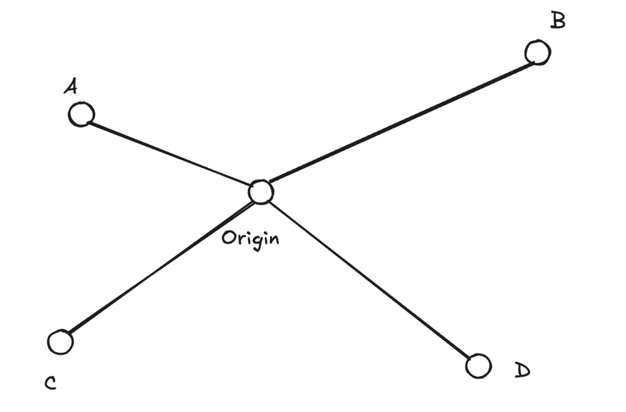
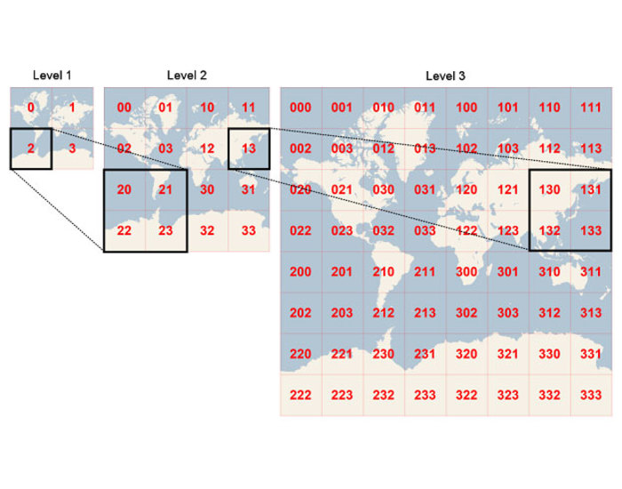
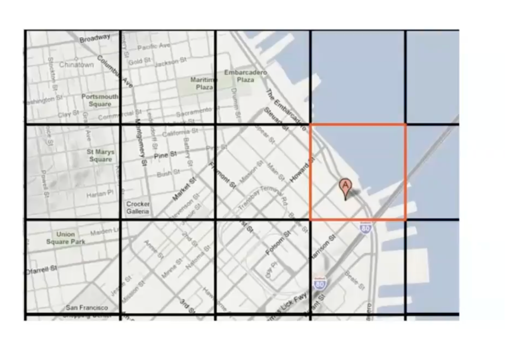
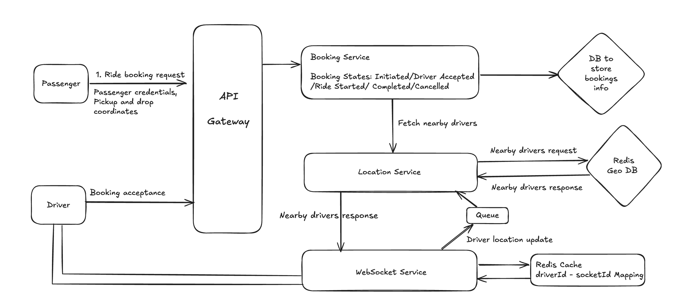
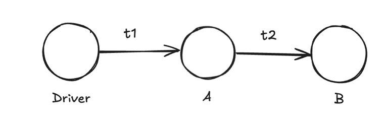
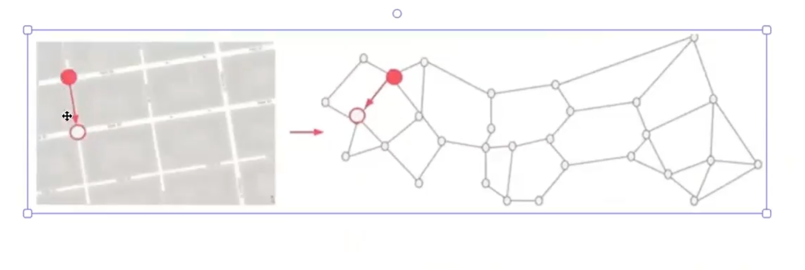

Interesting problem we'll be solving in this project: how to handle gelocation based data

**Requirement analysis**

Uber Service - Ride Matching Service

We'll be building a monolith project (to gain experience and understanding about monoliths) but for the sake of discussion, we'll use microservices in the HLD. 

Before we actually proceed with the HLD for Uber project, we should list down all the features to be built in the project. As an example, in a project like Uber, we should be handling user signup and authentication, driver signup and authentication etc. Now whether all those aspects need to be built or not during the interview or not, would depend on the requirement analysis. So, we'll try to list down all the requirements first and understand what we need to build.

Features:

1. User should be able to request a ride from A to B
2. Nearby drivers should be prompted with a request and they can accept or reject it. 
3. Based on the ride, we should be able to calculate approximate fare
4. ETA related data can be shown

In a design interview, it helps if we write down our thoughts.

Capacity estimation: Uber is a quite mature application, and it would have lot of scale in terms of user and driver signups or the number of cab bookings.

When we talk about requesting a ride from A to B, it's important to know that a location is nothing but a set of coordinates (latitude and longitude). So, we need to know (latitude A, longitude A) as well as (latitude B, longitude B)

Apart from that, when a user raises a cab request, we need to search for the drivers close by to A's location (maybe within 2km of A's location, as an example). And if there are no driver acceptances, then we increase the search radius gradually.

So, the problem actually boils down to finding K nearest drivers to A, which can be solved using priority queue data structure. How we can approach this problem: 

1. Calculate the euclidean distance of each point from the origin.

2. Maintain a max priority queue of k elements and do the required processing to make sure that only the smallest k elements remain in the priority queue.

Q. Why the solution above cannot be used in a ride matching app like Uber?

1. The earth is not a 2D Cartesian plane, in fact the earth is spherical and a 3D object.

2. In real life, the locations of the drivers is not going to be static, as their locations will keep on changing when they drive. But the assumption in the solution above is that the locations of the points is constant.

That's where a concept called geohashing comes into place. It is expected to know this concept when solving the problem of k nearest points.

Let's learn about the concept of geohashing:

1. We map the earth on a 2D plane

2. We divide the plane into multiple squares, and these squares are hierarchial in nature

The following diagram should help:

As we can see from the diagram above, at level 1, the world map is divided into four squares (called quadruplets), and each of them is assigned a code. In level 2, each of the squares from previous level is divided into four squares and an additional digit is assigned to the previous geohash.

It's clear that there is a hierarchial structure coming into the picture, hence geohash can be implemented using tree data structure (specifically a quadtree data structure). 

Q. What do the different levels in this hierarchial data structure represent?

A. The levels in the hierarchial structure represent the level of precision or granularity. As an example, level 1 would represent an entire continent whereas a higher level could represent a small block within a city.

Q. How does geohashing help us in the context of our project?

A. Given the latitude, latitude of pickup location, we can associate the coordinates with the cell to which they belong. In order to find drivers nearby, we would query the drivers in the cell. And if required, we could also query the neighbouring cells.

There are many geospatial indices which we can leverage for the sake of our personal project: (because we don't want to spend our efforts on constructing and storing the geohash information, haha)

1. Redis Geospatial
2. POSTGis
3. MongoDB
4. Uber H3 -> This is an open source geospatial index which Uber uses -> The cells are hexagonal in nature. [Github](https://github.com/uber/h3-js)

Why are the cells hexagonal in nature? 

1. Uniformity: Hexagons have a more consistent distance between cell centres, leading to a more uniform sampling of areas.

2. Edge Adjacency: Each hexagon shares edges with six neighbours, providing more natural adjacency relationships.

3. Efficient Sampling: Hexagons are better at approximating circles, which are often used in spatial queries.

[Reference](https://www.giskernel.com/harnessing-ubers-h3-spatial-indexing-system/)

We'll be leveraging Redis Geospatial Index because it's easy to get onboarded to and is highly scalable. Also, we need a index which can support high throughput as the driver's location data will be frequently updated, Redis is good in regard that as well as it's highly performant.

Let's discuss the High Level Design of this project, and we'll also take a look into the reasoning for the decisions:

We'll have the passenger and the driver on the client side. The passenger will submit a ride request, mentioning their credentials, pickup and drop coordinates. As we need to handle authentication in the app, we'll leverage an API Gateway. Apart from authentication, API Gateway will also perform several other functions like rate limiting, acting as reverse proxy etc. (API Gateway is an important part of any backend architecture, haha)

The incoming request will be forwarded to the Booking Service. A booking can be in any of the following states: INITIATED, DRIVER_ASSIGNED, RIDE_STARTED, COMPLETED and CANCELLED. The booking details will be persisted in the database. What type of database we should leverage: SQL database would be a good choice as we can have concurrent transactions when drivers accept the request. SQL databases ensure high consistency while executing transactions. But for a small scale personal project, even a NoSQL database like MongoDB will also do the job.

The booking service will forward the request to the location service, in order to query all the nearby drivers nearby to the pickup location. The location service will query all the nearby drivers by talking to the Redis Geo DB which stores the geospatial data of all the drivers. Once the nearby drivers are shortlisted, the list of these drivers will be communicated to the Web Socket Service. WHY? Because the drivers who have been shortlisted by the location service need to be prompted about the booking request. What can be the possible solutions here?

1. The client (driver) polling the backend services at regular intervals (Short Polling). This however, will put bombard the backend services with large number of requests. 

2. Use websockets between the backend and the client (driver). This is a better solution as it won't bombard the backend service with large number of requests.

Let's now discuss about the WebSocket Service as well:

The WebSocket Service is responsible for emitting events about booking requests to the drivers. It is also responsible for listening to driver's location updates and communicating those to the location service, so that location service can update them in the Redis Geo DB for any future booking requests.

It's a good solution to have async communication between the WebSocket service and the Location Service by using a message queue.

Q1. Should the WebSocket Service be behind the API Gateway? Or should it be a separate service that can be called by the client?

A. It's advisable to keep any service which requires constant connection (like WebSocket, TCP) etc separate from the API Gateway. This is because the chances of the socket connection being dropped are high if routed through an API gateway. And also, the answer to this question would also depend on whether the API gateway (if we are using an enterprise solution) supports routing socket requests or not.

References: [Reddit Link 1](https://www.reddit.com/r/microservices/comments/i7vb8h/should_a_websockets_server_be_behind_an_api/), [Reddit Link 2](https://www.reddit.com/r/microservices/comments/urog95/api_gateway_pattern_and_websockets_how_do_they/), [Stackexchange Link](https://softwareengineering.stackexchange.com/questions/432255/can-an-api-gateway-handle-websockets-requests-besides-regular-http-requests-at-t#:~:text=The%20short%20answer%20is%20%2D%20yes,gateway%20and%20call%20it%20seperately.), [Stackoverflow Link](https://stackoverflow.com/questions/47544877/websockets-in-microservices-architecture)

Q2. When the websocket needs to emit an event to the driver, how do we get the socketID corresponding to a driverID?

A2. Good question. In order to store these mapping, we can use:

1. An in-memory database within the Web Socket Service itself. Disadvantage: The data would be purged whenever the service restarts.

2. Redis Cache: This is a good solution as Redis has fast access mechanisms. Also, Redis has a configuration option that writes the contents to disk, and when it restarts, loads the data from disk into the database. Hence, overall a better choice.

When the driver accepts the booking request, they'll send a request to the Booking Service (routed through the API Gateway).

**Discussion on ETA**

The ETA for ride completion is nothing but the sum of the time taken to reach pickup point from the driver's location added to the trip time from pickup point to drop location.

Q. How do we calculate the time between two points? 

A. We have several options:

1. Use third party services like Google Maps

2. In case the interviewer insists on building an in-house solution, we can follow the approach described below:

We can leverage a graph DB in order to solve the problem. And then leverage shortest path algorithms like Dijkstra or A* algorithm etc.

In order to construct this graph, every turning point in the map can be treated as a vertex, and the streets between them will serve as the edges. The edge weights can take into account the distance, congestion factor, road quality etc.

Here's an example of how this graph would be constructed:

Once the ETA is calculated, the estimated fare can be calculated as Minimum Base Fare + Ride Fare which can be variable depending on the distance, congestion etc.

Q. How we can handle surges in price? 

A. We can have a demand-supply mechanism. If the number of booking requests from a geocell are growing quite rapidly compared to the number of available drivers, a surge pricing can be applied.

**Screenshots and Video Demo of the Project:**

To be updated

